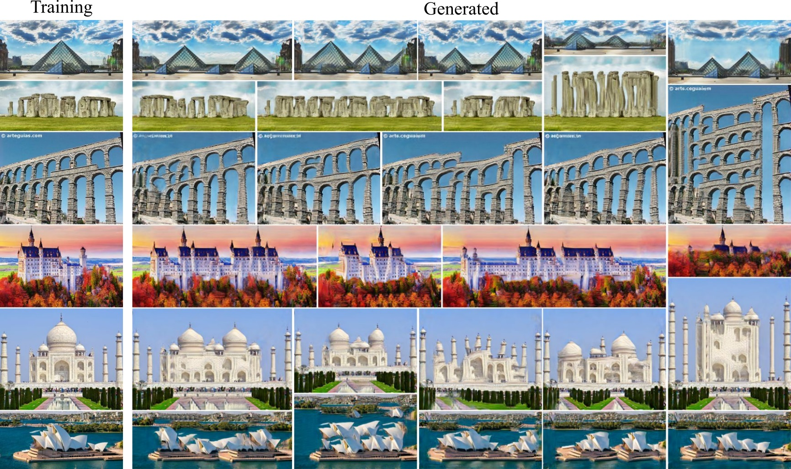
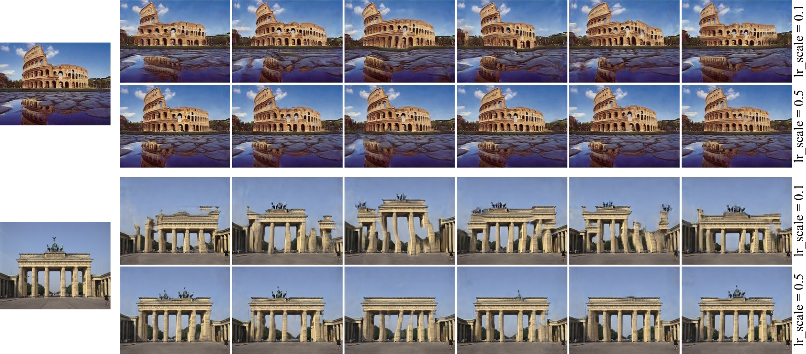
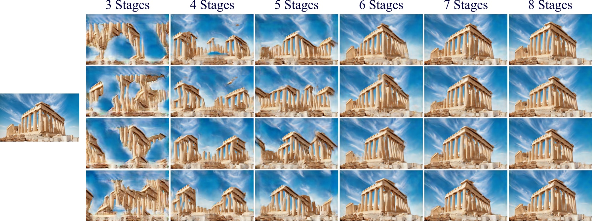

# ConSinGAN

Official implementation of the paper *"Improved Techniques for Training Single-Image GANs"* by Tobias Hinz, Matthew Fisher, Oliver Wang, and Stefan Wermter.

We examine and recomment new techniques for training GANs on a *single* image.
Our model is trained iteratively on several different resolutions of the original training image, where the resolution increases as training proceeds.
Whenever we increase the resolution of the training image we also increase the capacity of the generator by adding additional convolutional layers.
At a given time we do not train the full model, but only *parts* of it, i.e. the most recently added convolutional layers.
The latest convolutional layers are trained with a given learning rate, while previously existing convolutional layers are trained with a smaller learning rate.



# Installation

- python 3.5
- pytorch 1.1.0

```
pip install -r requirements.txt
```

# Unconditional Generation
To train a model with the default parameters from our paper run:

```
python main_train.py --gpu 0 --train_mode generation --input_name Images/Generation/angkorwat.jpg
```

To affect sample diversity and image quality we recomment playing around with the learning rate scaling (default is `0.1`) and the number of trained stages (default is `6`).
This can be especially helpful if the images are more complex (use a higher learning rate scaling) or you want to train on images with higher resolution (use more stages).
For example, increasing the learning rate scaling will mean that lower stages are trained with a higher learning rate and can, therefore, learn a more faithful model of the original image.
For example, observe the difference in generated images of the Colusseum if the model is trained with a learning rate scale of `0.1` or `0.5`:



To modify the learning rate scaling run:

```
python main_train.py --gpu 0 --train_mode generation --input_name Images/Generation/colusseum.jpg --lr_scale 0.5
```

Training on more stages can help with images that exhibit a large global structure that should stay the same, see e.g.:



To modify the number of trained stages run:

```
python main_train.py --gpu 0 --train_mode generation --input_name Images/Generation/colusseum.jpg --train_stages 7
```

The output is saved to `TrainedModels/` and we log the training process with Tensorboard.
The top left image in the visualized image grids is the original training image, all other images are generated images.
To monitor the progress go to the respective folder and run

```
 tensorboard --logdir .
```

To sample more images from a trained model run:

```
python evaluate_model.py --gpu 0 --model_dir TrainedModels/colusseum/.../ --num_samples 50
```

This will use the model to generate `num_samples` images in the default as well as scaled resolutions.
The results will be saved in a folder `Evaluation` in the `model_dir`.

# Unconditional Generation (Arbitrary Sizes)
todo

# Harmonization
todo

# Editing
todo

# Additional Data
todo upload images of user studies and training images for user studies
